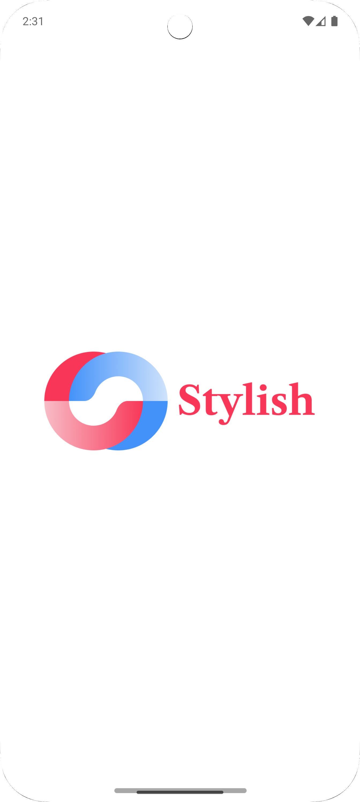
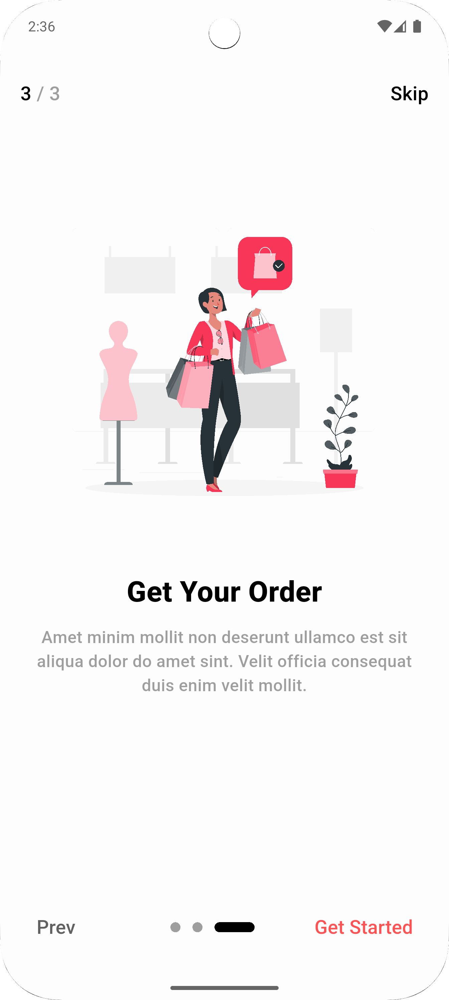
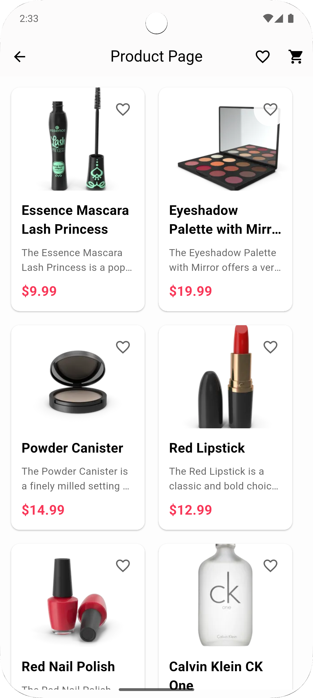
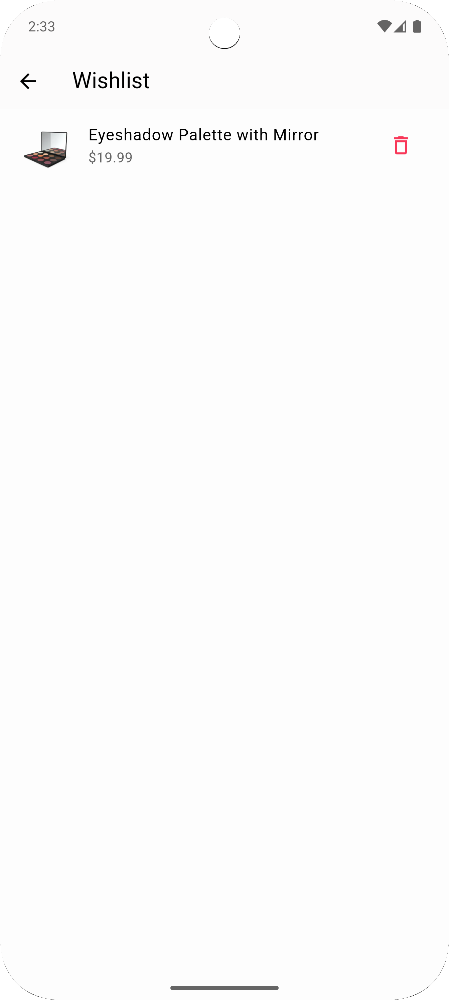
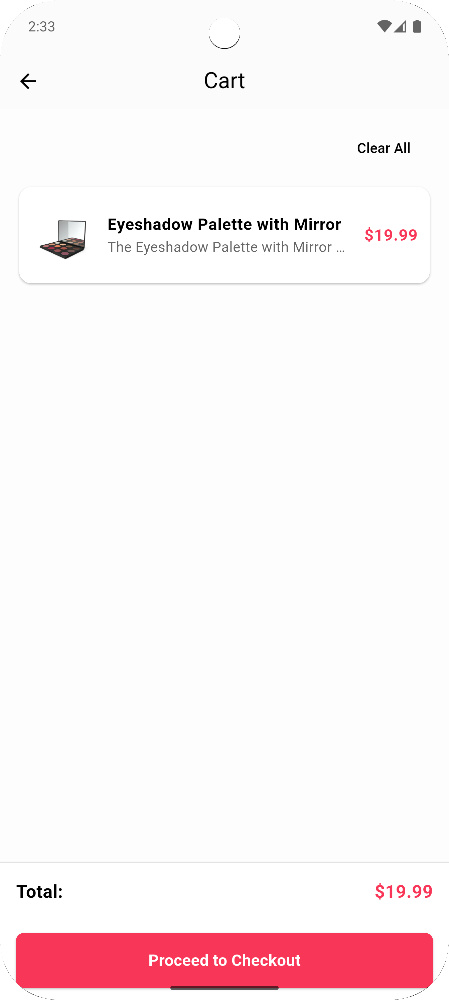
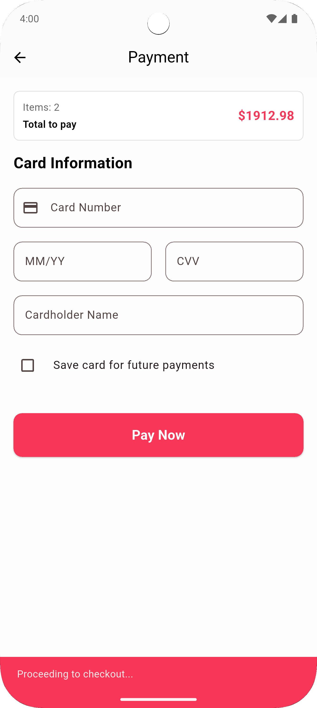

<div align="center">

# 🛍️ ITI E‑Commerce App

Modern Flutter shopping app with clean architecture (feature‑first), named routing, Bloc/Cubit state management, unified theming, and a realistic checkout flow.

</div>

---

## ✨ Highlights

- 🔧 __Feature‑first architecture__: clear separation by features under `lib/features/` and shared layers under `lib/core/` and `lib/shared/`.
- 🧭 __Named routing__: centralized in `lib/core/routing/routes.dart` with an `AppRouter`.
- 📦 __State management__: simple, predictable Cubits (`AddToCartCubit`, `WishlistCubit`, `ProductCubit`).
- 🎨 __Unified theme__: color scheme via `lib/core/theme/app_colors.dart` and `app_theme.dart`.
- 🔔 __Wishlist + Cart badges__: reusable `BadgeIconButton`.
- 💳 __Realistic Payment__: Luhn validation, brand detection (VISA/MC/AMEX/DISC), expiry/CVV checks, order summary, processing state, success screen.

---

## 🗺️ Project Structure

```
lib/
  app/
    presentation/page/
      get_started.dart
      post_page.dart
  core/
    routing/
      routes.dart
    theme/
      app_colors.dart
      app_theme.dart
    widgets/
      badge_icon_button.dart
  features/
    splash/presentation/pages/splash_screen.dart
    home/presentation/pages/home_page.dart
    products/
      logic/cubit/{product_cubit.dart, product_state.dart}
      presentation/pages/{product_page.dart, product_details_page.dart}
    cart/
      logic/cubit/{add_to_cart_cubit.dart, add_to_cart_state.dart}
      presentation/pages/cart_page.dart
    wishlist/
      logic/cubit/{wishlist_cubit.dart, wishlist_state.dart}
      presentation/pages/wishlist_page.dart
    payment/
      presentation/pages/{payment_page.dart, payment_success_page.dart}
  shared/
    widgets/product_card_widget.dart
    models/product_model.dart
main.dart
```

---

## 🛣️ Routes

Defined in `lib/core/routing/routes.dart`:

- `/` → `SplashScreen`
- `/home` → `HomePage`
- `/products` → `ProductPage`
- `/cart` → `CartPage`
- `/wishlist` → `WishlistPage`
- `/payment` → `PaymentPage`
- `/product-details` → `ProductDetailsPage`
- `/payment-success` → `PaymentSuccessPage`

---

## 🧠 State Management

- __Products__: `ProductCubit` fetches products from DummyJSON.
- __Cart__: `AddToCartCubit` maintains `CartState` with add/remove/clear and total.
- __Wishlist__: `WishlistCubit` toggles/add/remove and now supports `clear()` (used on Logout).

All provided high‑level in `main.dart` via `MultiBlocProvider`.

---

## 💳 Payment Flow (Realistic UX)

- Card number formatting (4‑digit grouping) and brand detection (VISA/MC/AMEX/DISC).
- Luhn validation for card numbers.
- Expiry `MM/YY` formatting and future date check.
- CVV length rules (AMEX=4, others=3).
- Order summary bound to Cart via `BlocBuilder`.
- Processing state with loader, then navigates to `PaymentSuccessPage`.

Files:
- `features/payment/presentation/pages/payment_page.dart`
- `features/payment/presentation/pages/payment_success_page.dart`

---

## 🧩 Tech Stack

- Flutter, Dart
- flutter_bloc, http, flutter_screenutil, flutter_svg, dots_indicator

---

## 🚀 Getting Started

### Prerequisites

- Flutter SDK (stable)
- Android Studio/Xcode emulators

### Install & Run

```bash
flutter pub get
flutter run
```

> Tip: Run `flutter analyze` to check for lints.

---

## 🖼️ Screenshots

Below are real app screenshots from the project assets.

|  |  |                                                                                               |  |
|---|---|-----------------------------------------------------------------------------------------------|---|
|  |  |  |  |

|  |  |  |  |
|---|---|---|---|
|  |  |  |  |

---

## 🔧 Notes & Next Steps

- Replace DummyJSON with your API/repository layer.
- Persist cart and wishlist (Hive/SharedPreferences) if you need offline.
- Add deep links and analytics as needed.

---

## 👨‍💻 Authors

Made with ❤️ by Abdelhalim Ramadan